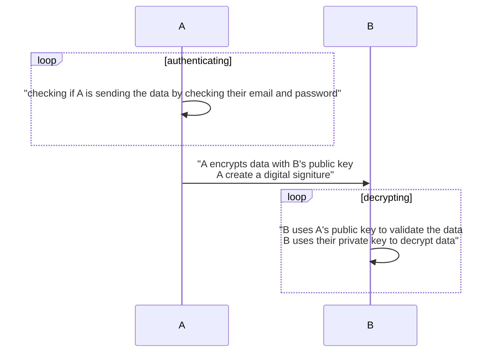

# Transfer Protocol

```mermaid
sequenceDiagram
	participant A
	participant B
	loop authenticating
		A ->> A: "checking if A is sending the data by checking their email and password"
	end
	A ->> B:"A encrypts data with B's public key<br> A create a digital signiture"
	loop decrypting
		B ->> B: "B uses A's public key to validate the data<br> B uses their private key to decrypt data"
	end
	
```
[[Authentication]] -> [[Encryption]] -> [[Digital Signiture]] 